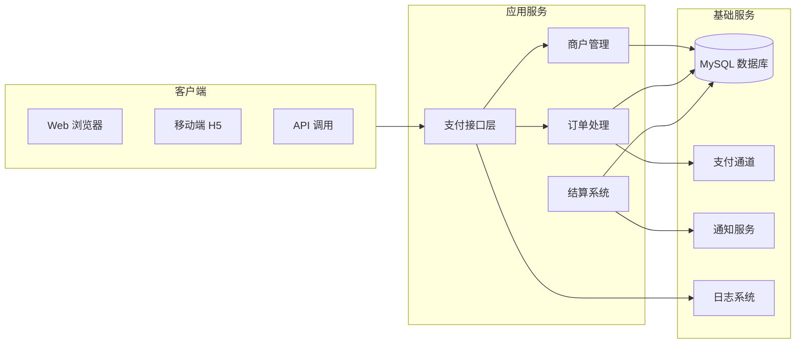
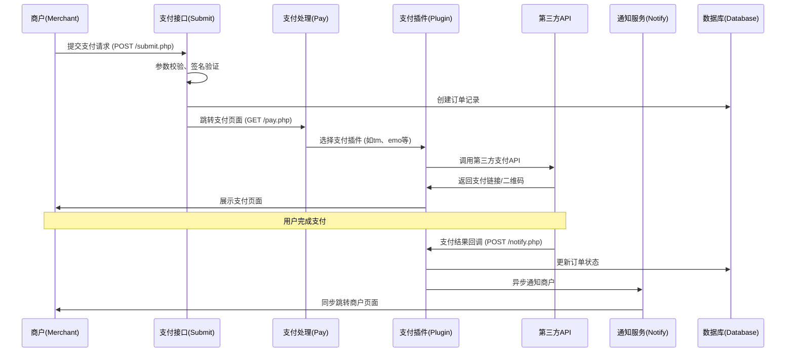
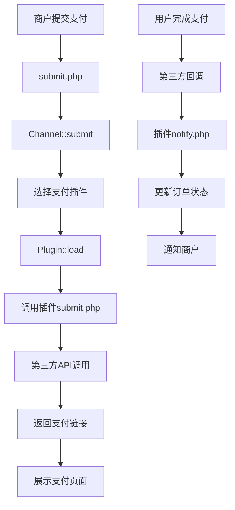

# 🗂 天使支付系统开发文档

> **开发文档的核心目标：**
> 
> 1. 知识传递 - 新人看文档就能快速理解系统和上手开发
> 2. 规范统一 - 统一格式和结构，提高团队协作效率
> 3. 降低交接成本 - 人员变动时减少依赖，实现快速交接
> 4. 打通协作链路 - 开发、运维、测试共享信息，避免孤岛
> 5. 可追溯审计 - 记录变更历史，便于问题回溯

---

## 0. 文档控制

| 字段 | 内容 | 说明 |
| --- | --- | --- |
| 文档编号 | DEV-TIANSHIPAY-STD | 统一编号，`DEV-系统-类型` |
| 版本 | v1.0 | 语义化版本 |
| 生效日期 | 2025-01-27 | 批准后生效 |
| 审批人(Approver) | 技术负责人 | 有发布/标准批准权 |
| 复审周期 | 每 6 个月 | 到期必须复审 |
| 文档密级 | 内部/受限 | 访问范围 |
| 记录保存年限 | ≥ 3 年 | 版本与评审记录保留 |

## 1. 基本信息

| 字段 | 内容 | 填写指引 |
| --- | --- | --- |
| **系统名称** | 天使支付系统（TianShiPay） | 系统全称 + 常用简称 |
| **系统 ID** | SYS-PAY-001 | 公司唯一编号，例如 `SYS-部门缩写-序号` |
| **负责人（Owner）** | 技术负责人 | 技术负责人，负责开发文档更新 |
| **备份人（Backup）** | 运维负责人 | 负责人的替补 |
| **代码仓库** | `git@github.com:aaachuge/newtianshizhifupay.git` | GitHub/GitLab 仓库地址 |
| **文档最后更新** | 2025-01-27 | 文档实际修改日期 |

---

## 2. 系统概述

| 项目 | 内容 | 填写指引 |
| --- | --- | --- |
| **一句话简介** | 天使支付是一个免签约支付平台，支持支付宝、微信、QQ钱包等多种支付方式，为商户提供一站式支付解决方案。 | 用 1-2 句话概述系统作用 |
| **主要功能** | - 多支付方式集成（支付宝/微信/QQ钱包）- 商户管理系统- 订单管理与结算- 支付通道管理- 风险控制与监控 | 列出 3~5 个主要功能 |
| **核心亮点 / 技术特性** | 免签约支付、多通道轮询、实时结算、风险控制 | 可选，突出与其他系统的区别 |

---

## 3. 系统架构（落地版）

### 3.1 系统组成与交互



**说明：**

- **支付接口层**：统一接收支付请求，参数校验、签名验证
- **商户管理**：商户注册、认证、权限管理
- **订单处理**：订单创建、状态更新、支付处理
- **结算系统**：自动结算、手动结算、资金管理
- **基础服务**：数据库、支付通道、通知、日志

---

### 3.2 模块说明表

> 用于快速定位功能 → 目录 → 文件

| 模块 | 功能说明 | 主要目录 | 关键入口文件/类 | 备注 |
| --- | --- | --- | --- | --- |
| **插件模块** | **第三方支付调用逻辑** | `/plugins` | 各支付插件目录 | **系统核心，包含199个支付插件** |
| 支付模块 | 支付接口、订单处理 | `/` | `submit.php` / `pay.php` | 核心支付逻辑 |
| 商户模块 | 商户管理、认证 | `/admin` | `shanghu.php` / `ulist.php` | 商户权限控制 |
| 订单模块 | 订单查询、统计 | `/admin` | `order.php` / `record.php` | 订单状态管理 |
| 结算模块 | 资金结算、转账 | `/admin` | `settle.php` / `transfer_*.php` | 资金安全 |
| 通道模块 | 支付通道管理 | `/admin` | `pay_channel.php` / `pay_type.php` | 通道配置 |
| 模板模块 | 前端模板 | `/template` | 各模板目录 | 用户界面 |

---

### 3.3 入口索引（Top 10 常改功能）

> 用于快速定位到具体方法/路由，建议由 Swagger/脚本自动生成

| 功能 | 路由/方法 | 文件位置 | 备注 |
| --- | --- | --- | --- |
| **插件管理** | `GET /admin/pay_plugin.php` → `updateAll()` | `/admin/pay_plugin.php:15` | **刷新199个支付插件列表** |
| **第三方支付调用** | `GET /pay/{plugin}/submit/{trade_no}` | `/plugins/{plugin}/submit.php` | **真实支付逻辑，如tm、emo等** |
| **支付回调处理** | `POST /pay/{plugin}/notify/{trade_no}` | `/plugins/{plugin}/notify.php` | **异步通知处理** |
| **支付页面展示** | `GET /pay/{plugin}/qrcode/{trade_no}` | `/plugins/{plugin}/qrcode.php` | **二维码/支付页面** |
| 创建支付订单 | `POST /submit.php` → `submit()` | `/submit.php:72` | 核心支付接口 |
| 支付处理 | `GET /pay.php` → `pay()` | `/pay.php:8` | 支付页面跳转 |
| 商户注册 | `POST /api.php?act=apply` → `apply()` | `/api.php:13` | 商户申请接口 |
| 订单查询 | `GET /api.php?act=order` → `order()` | `/api.php:112` | 订单状态查询 |
| 结算申请 | `POST /admin/settle.php` → `settle()` | `/admin/settle.php` | 资金结算 |
| 通道配置 | `POST /admin/pay_channel.php` → `config()` | `/admin/pay_channel.php` | 支付通道设置 |

---

### 3.4 主流程（最常用用户路径）

用一张图展示系统的核心业务流程，帮助新人快速理解功能运行顺序，并定位到相关代码模块



---

**阅读说明：**

- **M（商户 Merchant）** → 发起支付请求或接收通知
- **S（支付接口 Submit）** → 接收支付参数，做校验和转发
- **P（支付处理 Pay）** → 支付页面展示和插件选择
- **PL（支付插件 Plugin）** → **核心：199个第三方支付插件，真实支付逻辑**
- **API（第三方API）** → 支付宝、微信、QQ钱包等真实支付接口
- **N（通知服务 Notify）** → 处理支付结果通知
- **DB（数据库 Database）** → 存储订单和用户数据

---

## 4. 技术栈

| 组件 | 版本 | 用途 | 填写提示 |
| --- | --- | --- | --- |
| PHP | 7.4+ | 应用服务 | 主开发语言与框架 |
| MySQL | 5.7+ | 数据存储 | 数据库类型 |
| Apache/Nginx | 2.4+ | Web服务器 | Web服务器 |
| Bootstrap | 3.x | 前端框架 | UI组件库 |
| jQuery | 1.x | 前端交互 | JavaScript库 |
|  |  |  |  |

---

### 4.1 第三方依赖与许可

| 依赖 | 版本 | 用途 | 许可 | 风险/替代 |
| --- | --- | --- | --- | --- |
| 支付宝SDK | 最新 | 支付宝支付 | 商业许可 | 需申请商户号 |
| 微信支付SDK | 最新 | 微信支付 | 商业许可 | 需申请商户号 |
| QQ钱包SDK | 最新 | QQ钱包支付 | 商业许可 | 需申请商户号 |

## 5. 开发环境搭建

> 详见：《应用部署说明 - 天使支付》文档

### 5.1 环境要求
- PHP 7.4+
- MySQL 5.7+
- Apache/Nginx
- 支持URL重写

### 5.2 安装步骤
1. 下载源码到Web目录
2. 配置数据库连接（config.php）
3. 访问 `/install/` 进行安装
4. 配置伪静态规则
5. 配置支付通道

---

## 6. 接口文档（核心示例）

### 6.1 支付接口

**接口地址：** `POST /submit.php`

**请求参数：**
```json
{
  "pid": "商户ID",
  "type": "支付方式",
  "out_trade_no": "商户订单号",
  "notify_url": "异步通知地址",
  "return_url": "同步跳转地址",
  "name": "商品名称",
  "money": "支付金额",
  "sign": "签名"
}
```

**响应示例：**
```json
{
  "code": 200,
  "pay_url": "支付页面URL"
}
```

### 6.2 插件管理接口

**接口地址：** `GET /admin/pay_plugin.php?my=refresh`

**功能说明：** 刷新199个支付插件列表，扫描 `/plugins` 目录下的所有插件

**插件结构：**
```
/plugins/{plugin_name}/
├── config.ini          # 插件配置文件
├── submit.php          # 支付提交逻辑
├── notify.php          # 异步回调处理
├── qrcode.php          # 支付页面展示
├── return.php          # 同步跳转处理
└── pay/                # 支付相关类库
    ├── config.php
    ├── Http.php
    └── ...
```

### 6.3 第三方支付调用

**接口地址：** `GET /pay/{plugin}/submit/{trade_no}`

**功能说明：** 调用具体支付插件的提交逻辑

**示例：**
- `/pay/tm/submit/20250127123456/` → 调用TM支付插件
- `/pay/emo/submit/20250127123456/` → 调用恶魔支付插件

### 6.4 支付回调处理

**接口地址：** `POST /pay/{plugin}/notify/{trade_no}`

**功能说明：** 处理第三方支付平台的异步通知

### 6.5 订单查询接口

**接口地址：** `GET /api.php?act=order`

**请求参数：**
- `pid`: 商户ID
- `key`: 商户密钥
- `trade_no`: 系统订单号（可选）
- `out_trade_no`: 商户订单号（可选）

**响应示例：**
```json
{
  "code": 1,
  "trade_no": "系统订单号",
  "out_trade_no": "商户订单号",
  "status": "订单状态",
  "money": "支付金额"
}
```

---

## 7. 数据库结构（核心表）

### 7.1 核心表字段解析

| 表名 | 字段 | 类型 | 说明 |
| --- | --- | --- | --- |
| pay_user | **uid** | INT | 商户ID，主键 |
|  | **username** | VARCHAR(50) | 商户用户名 |
|  | **key** | VARCHAR(32) | 商户密钥 |
|  | **status** | TINYINT | 商户状态（0=禁用，1=启用） |
|  | **money** | DECIMAL(10,2) | 账户余额 |
|  | **settle** | TINYINT | 结算状态 |
| pay_order | **trade_no** | VARCHAR(32) | 系统订单号，主键 |
|  | **out_trade_no** | VARCHAR(32) | 商户订单号 |
|  | **uid** | INT | 商户ID |
|  | **money** | DECIMAL(10,2) | 支付金额 |
|  | **status** | TINYINT | 订单状态（0=待支付，1=已支付） |
|  | **addtime** | DATETIME | 创建时间 |
|  | **endtime** | DATETIME | 完成时间 |
| pay_channel | **id** | INT | 通道ID，主键 |
|  | **name** | VARCHAR(50) | 通道名称 |
|  | **plugin** | VARCHAR(50) | 支付插件 |
|  | **rate** | DECIMAL(5,2) | 通道费率 |
|  | **status** | TINYINT | 通道状态 |

### 7.2 索引与约束（最小必要集）

| 名称 | 类型 | 定义 | 作用 |
| --- | --- | --- | --- |
| **idx_uid** | INDEX | `(uid)` | 商户查询 |
| **idx_trade_no** | UNIQUE | `(trade_no)` | 订单号唯一 |
| **idx_out_trade_no** | INDEX | `(out_trade_no)` | 商户订单号查询 |
| **idx_status_time** | INDEX | `(status, addtime)` | 按状态和时间查询 |
| **idx_uid_status** | INDEX | `(uid, status)` | 商户订单状态查询 |

---

### 7.3 DDL 模板（核心表）

```sql
-- 商户表
CREATE TABLE `pay_user` (
  `uid` int(11) NOT NULL AUTO_INCREMENT,
  `username` varchar(50) NOT NULL,
  `key` varchar(32) NOT NULL,
  `status` tinyint(1) NOT NULL DEFAULT '1',
  `money` decimal(10,2) NOT NULL DEFAULT '0.00',
  `settle` tinyint(1) NOT NULL DEFAULT '1',
  `addtime` datetime NOT NULL,
  PRIMARY KEY (`uid`),
  UNIQUE KEY `username` (`username`),
  UNIQUE KEY `key` (`key`)
) ENGINE=InnoDB DEFAULT CHARSET=utf8;

-- 订单表
CREATE TABLE `pay_order` (
  `trade_no` varchar(32) NOT NULL,
  `out_trade_no` varchar(32) NOT NULL,
  `uid` int(11) NOT NULL,
  `money` decimal(10,2) NOT NULL,
  `status` tinyint(1) NOT NULL DEFAULT '0',
  `addtime` datetime NOT NULL,
  `endtime` datetime DEFAULT NULL,
  PRIMARY KEY (`trade_no`),
  KEY `idx_uid` (`uid`),
  KEY `idx_out_trade_no` (`out_trade_no`),
  KEY `idx_status_time` (`status`, `addtime`)
) ENGINE=InnoDB DEFAULT CHARSET=utf8;

-- 支付通道表
CREATE TABLE `pay_channel` (
  `id` int(11) NOT NULL AUTO_INCREMENT,
  `name` varchar(50) NOT NULL,
  `plugin` varchar(50) NOT NULL,
  `rate` decimal(5,2) NOT NULL DEFAULT '0.00',
  `status` tinyint(1) NOT NULL DEFAULT '1',
  PRIMARY KEY (`id`)
) ENGINE=InnoDB DEFAULT CHARSET=utf8;
```

---

### 7.4 30 秒勾选（上线前）

- [ ] 商户密钥（key）必须唯一且安全
- [ ] 订单号（trade_no）必须唯一
- [ ] 金额字段使用 DECIMAL 类型
- [ ] 时间字段统一使用 DATETIME
- [ ] 状态字段使用 TINYINT
- [ ] 所有表都有适当的索引

---

## 8. 业务规则

---

| **规则描述** | **说明** | **触发条件 / 备注** |
| --- | --- | --- |
| 支付金额限制 | 单笔支付金额必须在系统设定的最小值和最大值之间 | 在 submit.php 中校验 |
| 订单号唯一性 | 商户订单号（out_trade_no）在同一商户下必须唯一 | 创建订单时检查 |
| 签名验证 | 所有API请求必须通过签名验证 | 使用商户密钥进行MD5签名 |
| 异步通知 | 支付成功后必须发送异步通知给商户 | 最多重试5次，间隔递增 |
| 结算规则 | 商户可设置自动结算或手动结算 | 结算金额必须大于最小结算金额 |
| 风险控制 | 系统自动检测异常订单和风险商户 | 基于IP、金额、频率等维度 |

---

**使用说明**

1. **规则描述**：用动词或名词短语开头，简明描述规则核心。
2. **说明**：明确规则具体做法或数据来源。
3. **触发条件/备注**（可选）：写清楚规则生效的前提条件、特殊情况或配置入口。

---

## 9. 测试与质量

| 项目 | 内容 | 填写提示 |
| --- | --- | --- |
| 测试环境地址 | [http://test.tianshipay.com](http://test.tianshipay.com/) | 测试服务器访问地址 |
| 自动化测试 | `/tests` 目录 | 测试代码位置 |
| 测试账号 | `test001` / `123456` | 测试用例账号 |
| 回归测试 checklist | [测试文档链接](#) | 回归测试步骤或清单链接 |

---

## 10. 版本历史

| 版本 | 日期 | 更新内容 | 负责人 |
| --- | --- | --- | --- |
| v1.0 | 2025-01-27 | 初始版本上线 | 技术负责人 |
| v1.1 | 2025-02-01 | 增加微信支付 | 开发团队 |
| v1.2 | 2025-02-15 | 增加风险控制 | 开发团队 |

---

## 11. 关联资源

| 资源类型 | 链接 | 填写提示 |
| --- | --- | --- |
| 需求文档 | [链接](#) | 系统需求说明书 |
| UI 设计稿 | [链接](#) | 原型/设计图 |
| 部署文档 | [链接](#) | 对应 Deployment Guide |
| 应急手册 | [链接](#) | 对应 Runbook |

---

## 12. 安全与合规

| **项目** | **要求/措施** | **说明** |
| --- | --- | --- |
| 常见风险防护 | SQL 注入、越权访问、XSS攻击 | 必须做参数校验、权限检查、输入过滤 |
| 安全实践 | 代码审查、依赖库扫描 | 发现漏洞立即修复 |
| 日志审计 | 支付操作、资金变动写入 `pay_log` | 日志中敏感字段需脱敏 |
| 数据分级 | 支付金额=敏感财务信息 | 日志不记录完整金额 |
| 权限矩阵 | Merchant / Admin / SuperAdmin | 严格按角色分配权限 |
| 加密存储 | MD5+盐值 | 用于密码和签名 |
| 合规要求 | 支付行业规范、反洗钱 | 必须遵守相关法律法规 |
| 认证机制 | 签名验证 | 在所有支付相关接口中必须校验签名 |

## 13. 常见问题 & 故障排查

已知问题/坑

| 问题现象 | 可能原因 | 解决方案 |
| --- | --- | --- |
| **插件列表不显示** | 插件目录权限问题或config.ini格式错误 | 检查 `/plugins` 目录权限，验证 `config.ini` 格式 |
| **第三方支付调用失败** | 插件配置错误或API地址变更 | 检查插件 `config.ini` 配置，更新API地址 |
| **支付回调失败** | 商户回调地址不可达 | 检查网络连通性，查看 pay_log 表 |
| **订单状态不同步** | 异步通知处理异常 | 检查 notify_log 表，手动补发通知 |
| **支付通道异常** | 通道配置错误或通道方问题 | 检查通道配置，联系通道方 |
| **签名验证失败** | 商户密钥错误或参数顺序问题 | 检查签名算法，确认参数顺序 |
| **数据库连接失败** | 数据库配置错误或服务异常 | 检查 config.php，确认数据库服务状态 |

---

## 14. 开发规范

### 14.1 插件开发规范
- **插件目录命名**：使用英文小写，如 `tm`、`emo`、`alipay` 等
- **配置文件**：必须包含 `config.ini`，格式严格按照模板
- **核心文件**：必须包含 `submit.php`、`notify.php`、`qrcode.php`
- **命名空间**：使用 `if(!defined('IN_PLUGIN'))exit();` 保护
- **常量定义**：使用 `TRADE_NO`、`PAY_PLUGIN`、`PAY_ROOT` 等

### 14.2 插件配置文件规范
```ini
[config]
;支付插件英文名称，需和目录名称一致，不能有重复
name = "tm"
;支付插件显示名称
showname = "TM支付"
;支付插件作者
author = "tm"
;支付插件作者链接
link = "https://www.fa599.com/"
;支付插件支持的支付方式，多种方式用英文,隔开
types = "alipay,wxpay,qqpay,webbank,yunshanpay,kaka,shuzi"
;支付插件要求传入的参数以及参数显示名称
inputs = "appid:商户ID,appkey:密钥,appurl:自定义通道编号,apiurl:下单地址,huidiaourl:回调地址"
```

### 14.3 代码规范
- 使用 PSR-4 自动加载规范
- 类名使用大驼峰命名法
- 方法名使用小驼峰命名法
- 常量使用全大写命名法

### 14.4 数据库规范
- 表名使用 `pay_` 前缀
- 字段名使用下划线分隔
- 主键统一使用 `id` 或业务主键
- 时间字段统一使用 `datetime` 类型

### 14.5 安全规范
- 所有用户输入必须进行过滤和验证
- 数据库操作必须使用预处理语句
- 敏感信息必须加密存储
- 所有API接口必须进行签名验证
- 插件文件必须进行权限检查

---

## 15. 插件系统深度分析

### 15.1 插件系统架构

天使支付系统的核心是**插件化架构**，通过199个支付插件实现与各种第三方支付平台的对接。

#### 插件管理机制
```php
// 插件扫描和更新逻辑
class Plugin {
    static public function updateAll(){
        global $DB;
        $DB->exec("TRUNCATE TABLE pre_plugin");
        $list = self::getList();
        foreach($list as $name){
            if($config = self::getConfig($name)){
                if($config['name']!=$name)continue;
                $DB->exec("INSERT INTO pre_plugin VALUES (:name, :showname, :author, :link, :types, :inputs, :select)", 
                    [':name'=>$config['name'], ':showname'=>$config['showname'], ':author'=>$config['author'], 
                     ':link'=>$config['link'], ':types'=>$config['types'], ':inputs'=>$config['inputs'], ':select'=>$config['select']]);
            }
        }
        return true;
    }
}
```

#### 插件加载机制
```php
// 插件加载和路由处理
static public function load($s){
    if(preg_match('/^(.[a-zA-Z0-9]+)\/(.[a-zA-Z0-9]+)\/(.[0-9]+)\/$/',$s, $matchs)){
        $filename = PLUGIN_ROOT.$matchs[1].'/'.$matchs[2].'.php';
        if(file_exists($filename)){
            define("IN_PLUGIN", true);
            define("PAY_ROOT", PLUGIN_ROOT.$matchs[1].'/');
            define("TRADE_NO", $matchs[3]);
            define("PAY_PLUGIN", $matchs[1]);
            return $filename;
        }
    }
}
```

### 15.2 插件目录结构

```
/plugins/
├── tm/                    # TM支付插件
│   ├── config.ini         # 插件配置
│   ├── submit.php         # 支付提交
│   ├── notify.php         # 异步回调
│   ├── qrcode.php         # 支付页面
│   ├── return.php         # 同步跳转
│   └── pay/               # 支付类库
│       ├── config.php
│       ├── Http.php
│       └── ...
├── emo/                   # 恶魔支付插件
│   ├── config.ini
│   ├── submit.php
│   └── ...
└── ...                    # 其他197个插件
```

### 15.3 插件开发流程

1. **创建插件目录**：在 `/plugins/` 下创建插件目录
2. **编写配置文件**：创建 `config.ini` 文件
3. **实现核心方法**：
   - `submit.php` - 支付提交逻辑
   - `notify.php` - 异步回调处理
   - `qrcode.php` - 支付页面展示
4. **刷新插件列表**：访问 `/admin/pay_plugin.php?my=refresh`

### 15.4 插件调用流程



### 15.5 插件配置示例

以TM支付插件为例：

```ini
[config]
name = "tm"
showname = "TM支付"
author = "tm"
link = "https://www.fa599.com/"
types = "alipay,wxpay,qqpay,webbank,yunshanpay,kaka,shuzi"
inputs = "appid:商户ID,appkey:密钥,appurl:自定义通道编号,apiurl:下单地址,huidiaourl:回调地址"
```

### 15.6 插件核心文件分析

#### submit.php - 支付提交
```php
<?php
if(!defined('IN_PLUGIN'))exit();
include 'function.php';
$order= $DB->getRow("SELECT * FROM pre_order WHERE trade_no = '".$trade_no."'");
echo "<script>window.location.href='/pay/tm/qrcode/{$trade_no}/?sitename={$sitename}';</script>";
?>
```

#### notify.php - 异步回调
```php
<?php
if(!defined('IN_PLUGIN'))exit();
// 处理第三方支付回调
$returnArray = array(
    "version" => $_REQUEST["version"],
    "partnerid" => $_REQUEST["partnerid"],
    "partnerorderid" => $_REQUEST["partnerorderid"],
    "payamount" => $_REQUEST["payamount"],
    "orderstatus" => $_REQUEST["orderstatus"],
    // ... 其他参数
);
// 签名验证
$sign = md5($md5str . "key=" . $md5key);
if ($sign == $_REQUEST["sign"]) {
    if ($_REQUEST["orderstatus"] == "1") {
        // 更新订单状态
        $DB->exec("update `pre_order` set `status` ='1' where `trade_no`='$out_trade_no'");
        processOrder($order);
    }
}
?>
```

#### qrcode.php - 支付页面
```php
<?php
// 生成支付二维码和页面
$native = array(
    'version'=>"1.0",
    "partnerid" => $merId,
    "orderid" => TRADE_NO,
    "payamount" => $order['money']*100,
    "paytype" => $channel['appurl'],
    "notifyurl" => $huidiaourl."pay/tm/notify/".TRADE_NO.'/',
    "returnurl" => $huidiaourl."pay/tm/return/".TRADE_NO.'/',
);
// 调用第三方API
$submitData = Http::post($api,$native);
// 展示支付页面
?>
```

---

## 16. 部署说明

### 16.1 环境要求
- PHP 7.4+
- MySQL 5.7+
- Apache/Nginx
- 支持URL重写

### 16.2 部署步骤
1. 上传代码到Web目录
2. 配置数据库连接
3. 导入数据库结构
4. 配置Web服务器
5. 设置文件权限
6. 配置支付通道
7. **刷新插件列表**：访问 `/admin/pay_plugin.php?my=refresh`

### 16.3 伪静态配置
```nginx
location / {
    if (!-e $request_filename) {
        rewrite ^/(.[a-zA-Z0-9\-\_]+).html$ /index.php?mod=$1 last;
    }
    rewrite ^/pay/(.*)$ /pay.php?s=$1 last;
}
```

### 16.4 插件部署注意事项
- 确保 `/plugins` 目录有读写权限
- 新插件需要按照规范创建 `config.ini` 文件
- 部署后必须刷新插件列表才能生效
- 检查插件文件是否包含必要的核心方法

---

**文档结束**

> 本文档将根据系统更新持续维护，确保信息的准确性和时效性。
